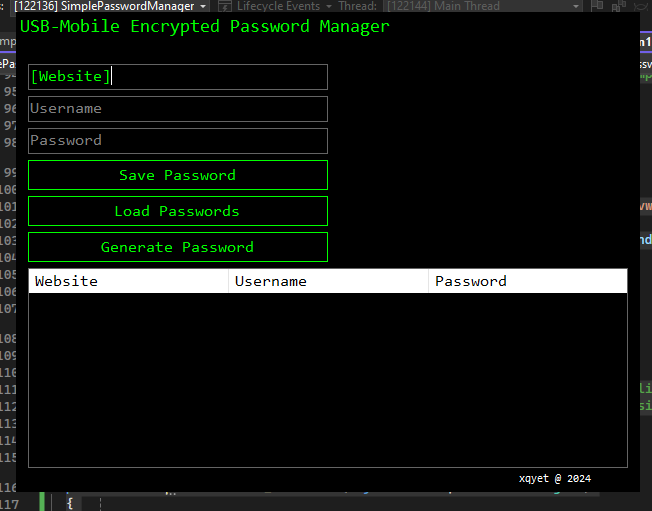

# Mini Password Encryption Manager

## Overview
A Windows Forms application developed in C# to manage and securely store user credentials such as website URLs, usernames, and passwords. Allows users to generate random passwords and save and load encrypted credentials. Doesn't work yet :/
## Features
- **Store and Retrieve Passwords**: Users can store and retrieve passwords for various websites.
- **Random Password Generator**: Built-in functionality to generate secure random passwords.
- **Retro Console-Like GUI**: Inspired by old-school command prompts, with lime green text on a black background.
- **Drag to Move**: The custom title bar allows the window to be moved by clicking and dragging.

## \\\\
Here's a screenshot of the GUI interface:



## How to Use
1. **Save Password**: Enter your website, username, and password, then click **Save Password** to store it securely.
2. **Load Passwords**: Click **Load Passwords** to retrieve the stored passwords and display them in the list.
3. **Generate Password**: Use the **Generate Password** button to create a secure random password.
## Installation
To run the program locally simply clone the repo
```bash
git clone https://github.com/your-username/SimplePasswordManager.git
```
